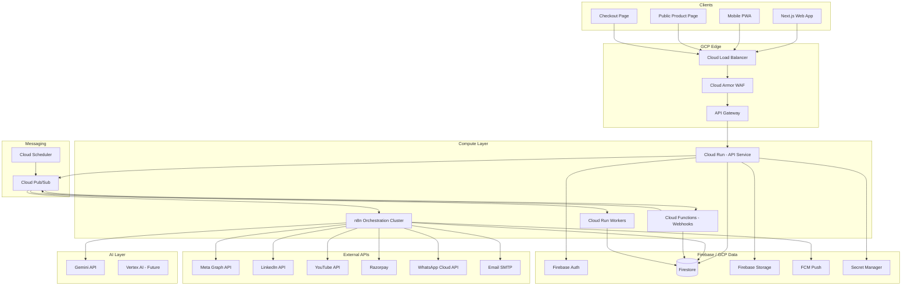

# AutoBot360 — Full System Architecture

## 1. Executive Summary

AutoBot360 is a **multi-tenant, event-driven, microservice-ready** social commerce SaaS. Tenants (sellers) connect social accounts, manage products, schedule AI-powered posts, monitor engagement, auto-reply with Gemini, capture leads, process Razorpay payments, and fulfill orders — all orchestrated via **n8n workflows** on **Google Cloud Platform** with **Firebase** as the data plane.

### Design Principles

| Principle | Implementation |
|-----------|----------------|
| Multi-tenancy | `tenantId` on every document; Firestore security rules |
| Event-driven | Pub/Sub topics for all async operations |
| Agent isolation | 14 bounded contexts, separate route modules |
| Queue-first | No synchronous social API calls from user requests |
| Fail-safe | DLQ + exponential retry + idempotency keys |
| Zero-trust | JWT + RBAC + encrypted OAuth tokens in Secret Manager |

---

## 2. High-Level Architecture



---

## 3. Request Flow — End-to-End

### 3.1 User Onboarding

```
Signup → Firebase Auth → Cloud Function (onCreate) → Firestore users/{uid}
     → Default tenant + free subscription → Pub/Sub: tenant.created
     → n8n: Welcome Email Workflow → Dashboard redirect
```

### 3.2 Product Publish Pipeline

```
User schedules post → POST /api/v1/publish/schedule
     → Product Agent validates → Firestore scheduled_posts/{id}
     → Pub/Sub: publish.requested { tenantId, postId, scheduledAt }
     → Cloud Scheduler OR immediate publish
     → n8n: Publish Product Workflow
         → Fetch product + social tokens (encrypted)
         → Gemini: AI Caption Workflow
         → Social Media Publish Workflow (per platform)
         → Save social_posts/{id} with platform post IDs
         → Pub/Sub: publish.completed
         → Comment Monitoring Workflow (webhook registration)
         → Analytics Sync Workflow
```

### 3.3 Comment → Lead → Sale Pipeline

```
Social webhook → Cloud Function → Pub/Sub: comment.received
     → n8n: Comment Monitoring Workflow
         → Fetch comment + post context
         → Gemini: intent classification (buying intent / question / spam)
         → IF buying_intent → Lead Capture Workflow
         → AI Reply Workflow → Post reply via platform API
         → Firestore: comments/{id}, leads/{id}, ai_replies/{id}
     → Customer clicks Buy Now on public page
     → Checkout Agent → Razorpay Payment Workflow
     → Order Creation Workflow → WhatsApp + Email notifications
```

---

## 4. Service Communication Matrix

| Source | Target | Protocol | Purpose |
|--------|--------|----------|---------|
| Next.js | API Gateway | HTTPS REST | CRUD, auth |
| API Service | Firestore | gRPC (Admin SDK) | Data persistence |
| API Service | Pub/Sub | gRPC publish | Async events |
| Pub/Sub | n8n Webhook | HTTPS POST | Workflow triggers |
| Pub/Sub | Cloud Run Workers | Push subscription | Heavy processing |
| n8n | Firestore REST / Admin | HTTPS | Read/write workflow data |
| n8n | Gemini API | HTTPS | AI generation |
| n8n | Social APIs | HTTPS OAuth | Publish, reply, fetch |
| Cloud Functions | Razorpay | HTTPS webhook | Payment verification |
| n8n | WhatsApp Cloud API | HTTPS | Notifications |
| Firebase Auth | API Service | JWT verify | Authentication |

---

## 5. Multi-Tenancy Model

Every Firestore document includes:

```typescript
interface TenantScoped {
  tenantId: string;      // UUID, maps to users.tenantId
  createdAt: Timestamp;
  updatedAt: Timestamp;
  createdBy: string;     // userId
}
```

**Tenant isolation rules:**
- Users belong to one `tenantId` (team accounts: shared tenant, role-based access)
- All queries MUST filter by `tenantId`
- API middleware injects `tenantId` from JWT claims
- n8n workflows receive `tenantId` in every Pub/Sub message envelope

---

## 6. Agent Architecture (Bounded Contexts)

Each agent is a **module** in the Express monolith (Phase 1) deployable as **separate Cloud Run services** (Phase 2).

```
services/api/src/
├── agents/
│   ├── auth/
│   ├── dashboard/
│   ├── product/
│   ├── social-connect/
│   ├── publish/
│   ├── comment-monitor/
│   ├── ai-sales/
│   ├── checkout/
│   ├── payment/
│   ├── order/
│   ├── whatsapp/
│   ├── analytics/
│   ├── notification/
│   └── orchestration/
├── middleware/
├── lib/
│   ├── firebase.ts
│   ├── pubsub.ts
│   ├── gemini.ts
│   └── crypto.ts
└── index.ts
```

**Inter-agent communication:** NEVER direct HTTP between agents. Always via Pub/Sub events or shared Firestore reads.

---

## 7. Event-Driven Topics (Pub/Sub)

| Topic | Publisher | Subscriber(s) | Payload |
|-------|-----------|---------------|---------|
| `tenant.created` | Auth Agent | n8n, Notification | `{ tenantId, userId }` |
| `product.created` | Product Agent | Analytics | `{ tenantId, productId }` |
| `publish.requested` | Publish Agent | n8n | `{ tenantId, postId, platforms[] }` |
| `publish.completed` | n8n | Comment Monitor, Analytics | `{ tenantId, postId, platformIds{} }` |
| `publish.failed` | n8n | Failed Retry, Notification | `{ tenantId, postId, error, attempt }` |
| `comment.received` | Webhook CF | n8n | `{ tenantId, commentId, platform }` |
| `lead.captured` | n8n | AI Sales, Notification | `{ tenantId, leadId, score }` |
| `checkout.started` | Checkout Agent | Analytics | `{ tenantId, sessionId }` |
| `payment.success` | Payment Agent | Order Agent, n8n | `{ tenantId, paymentId, orderDraft }` |
| `payment.failed` | Payment Agent | Notification | `{ tenantId, paymentId, reason }` |
| `order.created` | Order Agent | WhatsApp, Email, Analytics | `{ tenantId, orderId }` |
| `token.expiring` | Social Agent | n8n Token Refresh | `{ tenantId, accountId, platform }` |
| `analytics.sync` | Scheduler | n8n | `{ tenantId, dateRange }` |
| `notification.send` | Any | Notification Worker | `{ tenantId, type, payload }` |

**Dead Letter Queue:** Each subscription has `deadLetterTopic` + max 5 delivery attempts.

---

## 8. Scalability Strategy

### 8.1 Horizontal Scaling

| Component | Min | Max | Trigger |
|-----------|-----|-----|---------|
| API Cloud Run | 2 | 100 | CPU 70%, RPS |
| n8n Workers | 3 | 50 | Queue depth |
| Pub/Sub | — | — | Auto-scales |
| Firestore | — | — | Auto-scales, 1M+ writes/sec |

### 8.2 Scheduled Posts at Scale

- **Cloud Scheduler** publishes to `publish.requested` every minute
- **Sharding:** `scheduledAt` indexed; query posts where `scheduledAt <= now AND status = 'pending'`
- **Batch size:** 500 posts per scheduler tick per region
- **Concurrency:** n8n queue mode with Redis; max 50 parallel executions per tenant

### 8.3 Firestore Hot Partition Mitigation

- `tenantId` as first field in composite indexes
- Write sharding for analytics: `analytics/{tenantId}/events/{date}/{eventId}`
- Counter aggregation via Cloud Functions batch writes (not transactional reads on hot docs)

---

## 9. Error Handling Strategy

```
┌─────────────┐     fail      ┌──────────────┐
│   Attempt   │──────────────▶│ Retry Queue  │
│   (n8n/API) │               │ exp backoff  │
└─────────────┘               └──────┬───────┘
       │ success                      │ max 5
       ▼                              ▼
┌─────────────┐               ┌──────────────┐
│  Complete   │               │     DLQ      │
│  + metrics  │               │ + alert Pager│
└─────────────┘               └──────────────┘
```

**Idempotency:** All webhooks and payment callbacks use `idempotencyKey` stored in Firestore `idempotency_keys/{key}` with 24h TTL.

**Circuit breaker:** Social API calls use opossum circuit breaker (5 failures → open 30s).

---

## 10. Monitoring & Observability

| Signal | Tool | Alert Threshold |
|--------|------|-----------------|
| API latency p99 | Cloud Monitoring | > 2s |
| Error rate | Cloud Error Reporting | > 1% |
| Pub/Sub backlog | Cloud Monitoring | > 10k messages |
| n8n execution failures | Custom metric | > 5% / 5min |
| Payment webhook misses | Log-based metric | any miss |
| Firestore read/write | Firebase console | quota 80% |

**Structured logging:** JSON logs with `tenantId`, `traceId`, `agent`, `eventType`.

**Tracing:** Cloud Trace propagated via `X-Cloud-Trace-Context`.

---

## 11. Technology Versions

| Stack | Version |
|-------|---------|
| Node.js | 20 LTS |
| Next.js | 15.x |
| Express | 4.x |
| Firebase Admin | 12.x |
| n8n | 1.x (self-hosted) |
| Gemini | gemini-2.0-flash |
| TypeScript | 5.8 |

---

## 12. Phase Roadmap

| Phase | Scope | Timeline |
|-------|-------|----------|
| MVP | Auth, Products, Instagram publish, Dashboard | 8 weeks |
| V1 | All social platforms, AI replies, Razorpay | 12 weeks |
| V2 | Multi-agent Cloud Run split, Vertex AI | 16 weeks |
| Scale | Multi-region, CDN, enterprise SSO | 24 weeks |
