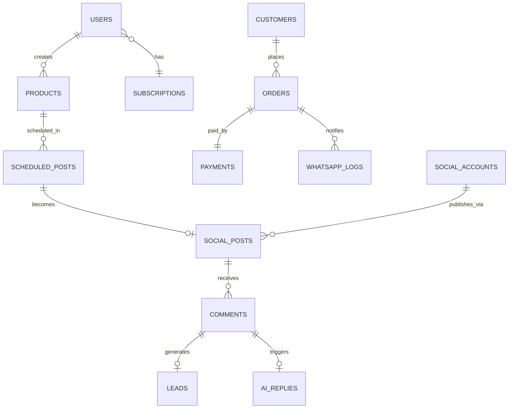

# AutoBot360 — Firestore Database Design

## Collection Hierarchy

```
firestore/
├── users/{userId}
├── subscriptions/{tenantId}
├── products/{productId}
├── orders/{orderId}
├── payments/{paymentId}
├── social_accounts/{accountId}
├── social_posts/{postId}
├── scheduled_posts/{postId}
├── comments/{commentId}
├── customers/{customerId}
├── notifications/{notificationId}
├── analytics/{tenantId}/daily/{date}
├── analytics/{tenantId}/posts/{postId}
├── ai_replies/{replyId}
├── whatsapp_logs/{logId}
├── checkout_sessions/{sessionId}
├── workflow_executions/{executionId}
├── idempotency_keys/{key}
└── dashboard_cache/{tenantId}
```

---

## Document Schemas

### users/{userId}

```typescript
{
  uid: string;
  email: string;
  displayName: string;
  photoURL?: string;
  tenantId: string;
  role: 'owner' | 'admin' | 'editor' | 'viewer';
  subscriptionId: string;
  onboardingCompleted: boolean;
  preferences: {
    theme: 'light' | 'dark' | 'system';
    timezone: string;
    locale: string;
    notifications: NotificationPrefs;
  };
  createdAt: Timestamp;
  updatedAt: Timestamp;
  lastLoginAt: Timestamp;
}
```

### subscriptions/{tenantId}

```typescript
{
  tenantId: string;
  plan: 'free' | 'starter' | 'pro' | 'enterprise';
  status: 'active' | 'past_due' | 'cancelled' | 'trialing';
  razorpaySubscriptionId?: string;
  limits: {
    products: number;
    scheduledPosts: number;
    socialAccounts: number;
    aiRepliesPerMonth: number;
    teamMembers: number;
  };
  usage: {
    products: number;
    scheduledPosts: number;
    aiReplies: number;
  };
  currentPeriodStart: Timestamp;
  currentPeriodEnd: Timestamp;
  createdAt: Timestamp;
}
```

### products/{productId}

```typescript
{
  tenantId: string;
  title: string;
  slug: string;
  description: string;
  aiDescription?: string;
  price: number;
  compareAtPrice?: number;
  currency: 'INR';
  sku: string;
  inventory: number;
  trackInventory: boolean;
  status: 'draft' | 'active' | 'archived';
  images: Array<{ url: string; alt: string; order: number }>;
  variants: Array<{
    id: string;
    name: string;
    options: Record<string, string>;
    price: number;
    sku: string;
    inventory: number;
  }>;
  categories: string[];
  tags: string[];
  seo: { title: string; description: string };
  publicUrl: string;
  createdAt: Timestamp;
  updatedAt: Timestamp;
  createdBy: string;
}
```

### scheduled_posts/{postId}

```typescript
{
  tenantId: string;
  productId: string;
  platforms: Array<'instagram' | 'facebook' | 'youtube' | 'linkedin'>;
  socialAccountIds: string[];
  caption?: string;
  useAiCaption: boolean;
  hashtags: string[];
  mediaUrls: string[];
  scheduledAt: Timestamp;
  timezone: string;
  status: 'pending' | 'processing' | 'published' | 'failed' | 'cancelled';
  retryCount: number;
  lastError?: string;
  idempotencyKey: string;
  createdAt: Timestamp;
  updatedAt: Timestamp;
}
```

### social_posts/{postId}

```typescript
{
  tenantId: string;
  scheduledPostId: string;
  productId: string;
  platform: string;
  platformPostId: string;
  platformPermalink: string;
  caption: string;
  mediaUrls: string[];
  publishedAt: Timestamp;
  engagement: {
    likes: number;
    comments: number;
    shares: number;
    reach: number;
    lastSyncedAt: Timestamp;
  };
  monitoringActive: boolean;
  webhookRegistered: boolean;
}
```

### social_accounts/{accountId}

```typescript
{
  tenantId: string;
  platform: 'instagram' | 'facebook' | 'youtube' | 'linkedin';
  platformUserId: string;
  username: string;
  displayName: string;
  profilePictureUrl: string;
  secretRef: string;          // Secret Manager resource name
  tokenExpiresAt: Timestamp;
  scopes: string[];
  status: 'active' | 'expired' | 'revoked' | 'error';
  lastValidatedAt: Timestamp;
  connectedAt: Timestamp;
  connectedBy: string;
}
```

### comments/{commentId}

```typescript
{
  tenantId: string;
  socialPostId: string;
  platform: string;
  platformCommentId: string;
  authorId: string;
  authorUsername: string;
  authorName: string;
  text: string;
  parentCommentId?: string;
  intent: 'buying' | 'question' | 'praise' | 'complaint' | 'spam' | 'unknown';
  intentScore: number;
  aiReplyGenerated: boolean;
  aiReplyId?: string;
  repliedAt?: Timestamp;
  leadId?: string;
  receivedAt: Timestamp;
}
```

### customers/{customerId}

```typescript
{
  tenantId: string;
  name: string;
  email?: string;
  phone?: string;
  whatsappNumber?: string;
  platformProfiles: Record<string, { id: string; username: string }>;
  totalOrders: number;
  totalSpent: number;
  tags: string[];
  conversationHistory: Array<{
    channel: string;
    message: string;
    direction: 'in' | 'out';
    timestamp: Timestamp;
  }>;
  createdAt: Timestamp;
  updatedAt: Timestamp;
}
```

### orders/{orderId}

```typescript
{
  tenantId: string;
  orderNumber: string;
  customerId: string;
  customer: { name: string; email: string; phone: string };
  items: Array<{
    productId: string;
    variantId?: string;
    title: string;
    quantity: number;
    price: number;
    total: number;
  }>;
  subtotal: number;
  tax: number;
  shipping: number;
  discount: number;
  total: number;
  currency: 'INR';
  status: 'pending' | 'confirmed' | 'processing' | 'shipped' | 'delivered' | 'cancelled' | 'refunded';
  paymentId: string;
  shippingAddress: Address;
  trackingNumber?: string;
  source: 'instagram' | 'facebook' | 'direct' | 'whatsapp';
  sourcePostId?: string;
  notificationsSent: { whatsapp: boolean; email: boolean };
  createdAt: Timestamp;
  updatedAt: Timestamp;
}
```

### payments/{paymentId}

```typescript
{
  tenantId: string;
  orderId?: string;
  checkoutSessionId: string;
  razorpayOrderId: string;
  razorpayPaymentId?: string;
  amount: number;
  currency: 'INR';
  status: 'created' | 'authorized' | 'captured' | 'failed' | 'refunded';
  method?: string;
  signature?: string;
  idempotencyKey: string;
  webhookEvents: Array<{ event: string; receivedAt: Timestamp }>;
  createdAt: Timestamp;
  capturedAt?: Timestamp;
}
```

### notifications/{notificationId}

```typescript
{
  tenantId: string;
  userId: string;
  type: 'order' | 'lead' | 'publish' | 'payment' | 'system' | 'ai';
  title: string;
  body: string;
  data: Record<string, unknown>;
  read: boolean;
  channels: Array<'in_app' | 'push' | 'email' | 'whatsapp'>;
  createdAt: Timestamp;
}
```

### ai_replies/{replyId}

```typescript
{
  tenantId: string;
  commentId?: string;
  conversationId?: string;
  prompt: string;
  response: string;
  model: 'gemini-2.0-flash';
  tokensUsed: number;
  approved: boolean;
  autoSent: boolean;
  sentAt?: Timestamp;
  createdAt: Timestamp;
}
```

### whatsapp_logs/{logId}

```typescript
{
  tenantId: string;
  to: string;
  templateName?: string;
  messageType: 'template' | 'text' | 'order_update';
  payload: Record<string, unknown>;
  wamid?: string;
  status: 'queued' | 'sent' | 'delivered' | 'read' | 'failed';
  error?: string;
  orderId?: string;
  createdAt: Timestamp;
}
```

### analytics/{tenantId}/daily/{date}

```typescript
{
  date: string;               // YYYY-MM-DD
  postsPublished: number;
  totalEngagement: number;
  leadsCaptured: number;
  ordersCount: number;
  revenue: number;
  conversionRate: number;
  topPostId?: string;
  platformBreakdown: Record<string, { posts: number; engagement: number }>;
}
```

---

## Composite Indexes (firestore.indexes.json)

```json
{
  "indexes": [
    {
      "collectionGroup": "products",
      "queryScope": "COLLECTION",
      "fields": [
        { "fieldPath": "tenantId", "order": "ASCENDING" },
        { "fieldPath": "status", "order": "ASCENDING" },
        { "fieldPath": "createdAt", "order": "DESCENDING" }
      ]
    },
    {
      "collectionGroup": "scheduled_posts",
      "queryScope": "COLLECTION",
      "fields": [
        { "fieldPath": "status", "order": "ASCENDING" },
        { "fieldPath": "scheduledAt", "order": "ASCENDING" }
      ]
    },
    {
      "collectionGroup": "scheduled_posts",
      "queryScope": "COLLECTION",
      "fields": [
        { "fieldPath": "tenantId", "order": "ASCENDING" },
        { "fieldPath": "status", "order": "ASCENDING" },
        { "fieldPath": "scheduledAt", "order": "DESCENDING" }
      ]
    },
    {
      "collectionGroup": "orders",
      "queryScope": "COLLECTION",
      "fields": [
        { "fieldPath": "tenantId", "order": "ASCENDING" },
        { "fieldPath": "status", "order": "ASCENDING" },
        { "fieldPath": "createdAt", "order": "DESCENDING" }
      ]
    },
    {
      "collectionGroup": "comments",
      "queryScope": "COLLECTION",
      "fields": [
        { "fieldPath": "tenantId", "order": "ASCENDING" },
        { "fieldPath": "intent", "order": "ASCENDING" },
        { "fieldPath": "receivedAt", "order": "DESCENDING" }
      ]
    },
    {
      "collectionGroup": "notifications",
      "queryScope": "COLLECTION",
      "fields": [
        { "fieldPath": "tenantId", "order": "ASCENDING" },
        { "fieldPath": "userId", "order": "ASCENDING" },
        { "fieldPath": "read", "order": "ASCENDING" },
        { "fieldPath": "createdAt", "order": "DESCENDING" }
      ]
    },
    {
      "collectionGroup": "social_posts",
      "queryScope": "COLLECTION",
      "fields": [
        { "fieldPath": "tenantId", "order": "ASCENDING" },
        { "fieldPath": "publishedAt", "order": "DESCENDING" }
      ]
    }
  ],
  "fieldOverrides": [
    {
      "collectionGroup": "checkout_sessions",
      "fieldPath": "expiresAt",
      "ttl": true
    },
    {
      "collectionGroup": "idempotency_keys",
      "fieldPath": "expiresAt",
      "ttl": true
    }
  ]
}
```

---

## Relationships Diagram



---

## Data Access Patterns

| Pattern | Query | Index Required |
|---------|-------|----------------|
| Tenant products list | `products.where('tenantId','==',t).orderBy('createdAt','desc')` | tenantId + createdAt |
| Pending publishes | `scheduled_posts.where('status','==','pending').where('scheduledAt','<=',now)` | status + scheduledAt |
| Tenant orders | `orders.where('tenantId','==',t).orderBy('createdAt','desc')` | tenantId + createdAt |
| Buying intent comments | `comments.where('tenantId','==',t).where('intent','==','buying')` | tenantId + intent + receivedAt |
| Unread notifications | `notifications.where('userId','==',u).where('read','==',false)` | tenantId + userId + read + createdAt |
