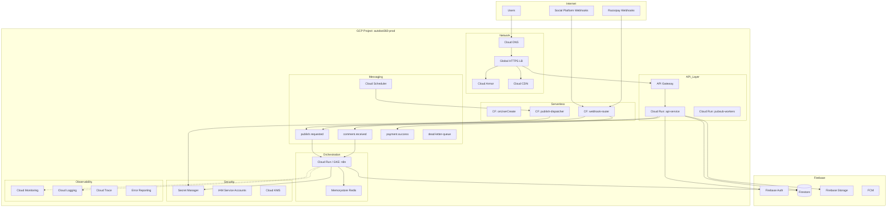

# AutoBot360 — Google Cloud Platform Architecture

## Infrastructure Diagram



---

## Service Accounts

| Service Account | Used By | Permissions |
|-----------------|---------|-------------|
| `sa-api@` | Cloud Run API | Firestore R/W, Pub/Sub publish, Secret accessor |
| `sa-n8n@` | n8n cluster | Firestore R/W, Secret accessor, Pub/Sub sub |
| `sa-worker@` | Pub/Sub workers | Firestore R/W, FCM send |
| `sa-functions@` | Cloud Functions | Pub/Sub publish, Firestore R/W |
| `sa-scheduler@` | Cloud Scheduler | Pub/Sub publish |
| `sa-cicd@` | GitHub Actions | Cloud Run deploy, Artifact Registry |

---

## Cloud Run Configuration

### api-service

```yaml
apiVersion: serving.knative.dev/v1
kind: Service
metadata:
  name: autobot360-api
spec:
  template:
    metadata:
      annotations:
        autoscaling.knative.dev/minScale: "2"
        autoscaling.knative.dev/maxScale: "100"
        run.googleapis.com/cpu-throttling: "false"
    spec:
      containerConcurrency: 80
      timeoutSeconds: 300
      containers:
        - image: gcr.io/autobot360-prod/api:latest
          resources:
            limits:
              cpu: "2"
              memory: 2Gi
          env:
            - name: NODE_ENV
              value: production
            - name: GCP_PROJECT_ID
              value: autobot360-prod
          ports:
            - containerPort: 8080
```

### n8n-service

```yaml
# n8n requires persistent queue — deploy on GKE for production
# MVP: Cloud Run with Memorystore Redis for queue mode
env:
  EXECUTIONS_MODE: queue
  QUEUE_BULL_REDIS_HOST: redis-memorystore-ip
  N8N_ENCRYPTION_KEY: from Secret Manager
  WEBHOOK_URL: https://n8n.autobot360.com/
```

---

## Pub/Sub Topology

```
Topics:
  autobot360.tenant.created
  autobot360.product.created
  autobot360.publish.requested
  autobot360.publish.completed
  autobot360.publish.failed
  autobot360.comment.received
  autobot360.lead.captured
  autobot360.checkout.started
  autobot360.payment.success
  autobot360.payment.failed
  autobot360.order.created
  autobot360.token.expiring
  autobot360.analytics.sync
  autobot360.notification.send
  autobot360.dlq

Subscriptions (push):
  sub-n8n-publish      → https://n8n.../webhook/publish-product
  sub-n8n-comment      → https://n8n.../webhook/comment-monitoring
  sub-n8n-payment      → https://n8n.../webhook/razorpay-payment
  sub-n8n-order        → https://n8n.../webhook/order-creation
  sub-worker-analytics → https://api.../internal/analytics-ingest
  sub-dlq-alerts       → PagerDuty via Cloud Function
```

**Message envelope (all topics):**

```json
{
  "eventId": "uuid",
  "eventType": "publish.requested",
  "timestamp": "2026-05-17T10:00:00Z",
  "tenantId": "tenant_abc123",
  "traceId": "projects/autobot360/traces/xyz",
  "idempotencyKey": "publish_post_abc_20260517",
  "payload": { }
}
```

---

## API Gateway

```yaml
swagger: "2.0"
info:
  title: AutoBot360 API
  version: "1.0.0"
host: api.autobot360.com
schemes:
  - https
securityDefinitions:
  firebase:
    authorizationUrl: ""
    flow: implicit
    type: oauth2
    x-google-issuer: "https://securetoken.google.com/autobot360-prod"
    x-google-jwks_uri: "https://www.googleapis.com/service_accounts/v1/metadata/x509/securetoken@system.gserviceaccount.com"
    x-google-audiences: "autobot360-prod"
paths:
  /api/v1/**:
    get, post, put, delete:
      x-google-backend:
        address: https://autobot360-api-xxxxx.run.app
      security:
        - firebase: []
```

---

## Secret Manager Layout

```
projects/autobot360-prod/secrets/
├── firebase-admin-key
├── jwt-signing-secret
├── gemini-api-key
├── razorpay-key-id
├── razorpay-key-secret
├── razorpay-webhook-secret
├── whatsapp-access-token
├── whatsapp-phone-number-id
├── n8n-encryption-key
├── n8n-webhook-secret
├── smtp-password
├── social-token-{tenantId}-{accountId}   (per-account, dynamic)
└── meta-app-secret
```

---

## Cloud Scheduler Jobs

| Job | Schedule | Target | Purpose |
|-----|----------|--------|---------|
| `dispatch-scheduled-posts` | `* * * * *` | Pub/Sub `publish.requested` | Every minute |
| `token-expiry-scan` | `0 2 * * *` | Pub/Sub `token.expiring` | Daily 2 AM |
| `analytics-sync` | `0 * * * *` | Pub/Sub `analytics.sync` | Hourly |
| `subscription-usage-reset` | `0 0 1 * *` | Cloud Function | Monthly |

---

## Autoscaling Strategy

| Service | Metric | Target | Max Instances |
|---------|--------|--------|---------------|
| API Cloud Run | CPU utilization | 70% | 100 |
| API Cloud Run | Request concurrency | 80 req/instance | 100 |
| n8n workers | Redis queue depth | < 1000 | 50 |
| Pub/Sub | — | Native auto-scale | Unlimited |

**Multi-region (Phase 2):**
- Primary: `asia-south1` (Mumbai) — India market
- Secondary: `us-central1` — global failover
- Firestore: multi-region `nam5` or single-region with replication

---

## Cloud Monitoring Dashboards

1. **API Health** — latency p50/p95/p99, error rate, RPS
2. **Publish Pipeline** — scheduled → processing → published funnel
3. **Payment Funnel** — checkout → payment → order conversion
4. **n8n Executions** — success/fail rate, avg duration
5. **Firestore** — read/write ops, index usage
6. **Cost** — per-service billing breakdown

---

## Vertex AI (Future)

```
Gemini API (current) → Vertex AI Gemini (migration path)
  - Model Garden for fine-tuned sales models
  - Vector Search for product similarity (RAG)
  - Conversation AI agents with tool calling
```
