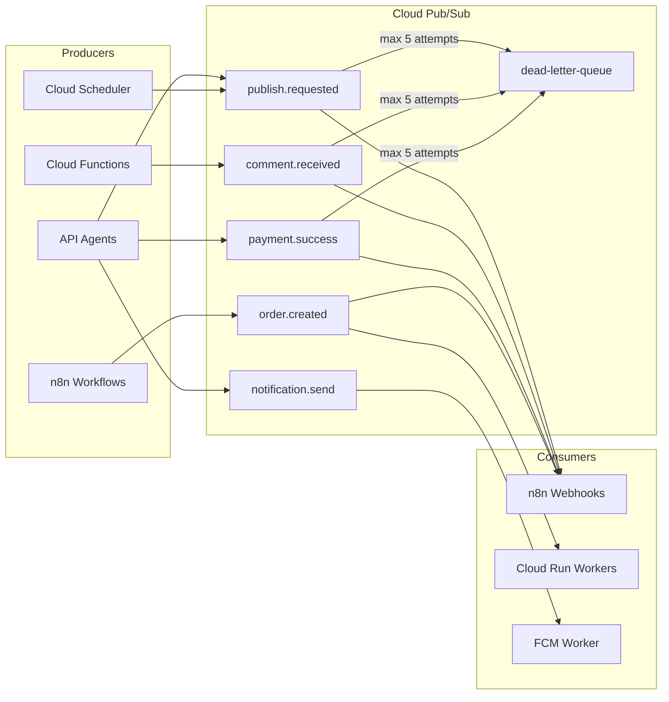

# AutoBot360 — Event-Driven & Queue Architecture

## Event Flow Diagram



---

## Message Contract

All events follow this envelope:

```typescript
interface CloudEvent<T = unknown> {
  eventId: string;           // UUID v4
  eventType: string;         // dot.notation
  version: '1.0';
  timestamp: string;         // ISO 8601
  tenantId: string;
  userId?: string;
  traceId: string;           // W3C trace context
  idempotencyKey: string;
  payload: T;
  metadata?: {
    source: string;          // agent name
    correlationId?: string;  // links related events
  };
}
```

---

## Queue Processing Rules

### Ordering
- **Per-tenant ordering NOT guaranteed** (Pub/Sub default)
- Use `orderingKey: tenantId` for payment events (strict order)
- Publish events: idempotency prevents duplicate posts

### Concurrency
```yaml
# Pub/Sub push subscription
pushConfig:
  pushEndpoint: https://n8n.autobot360.com/webhook/...
  oidcToken:
    serviceAccountEmail: sa-n8n@autobot360-prod.iam.gserviceaccount.com
flowControl:
  maxOutstandingMessages: 100
  maxOutstandingBytes: 10485760
retryPolicy:
  minimumBackoff: 10s
  maximumBackoff: 600s
deadLetterPolicy:
  deadLetterTopic: projects/autobot360-prod/topics/autobot360.dlq
  maxDeliveryAttempts: 5
```

### n8n Queue Mode (Bull + Redis)
```env
EXECUTIONS_MODE=queue
QUEUE_BULL_REDIS_HOST=10.0.0.5
QUEUE_HEALTH_CHECK_ACTIVE=true
N8N_CONCURRENCY_PRODUCTION_LIMIT=50
```

---

## Event Catalog

### publish.requested
```json
{
  "eventType": "publish.requested",
  "payload": {
    "scheduledPostId": "sp_001",
    "productId": "prod_001",
    "platforms": ["instagram"],
    "socialAccountIds": ["sa_001"],
    "useAiCaption": true,
    "scheduledAt": "2026-05-18T10:00:00Z"
  }
}
```
**Consumers:** n8n Publish Product Workflow

### comment.received
```json
{
  "eventType": "comment.received",
  "payload": {
    "platform": "instagram",
    "platformPostId": "ig_123",
    "platformCommentId": "cmt_456",
    "authorUsername": "buyer_jane",
    "text": "Price please?",
    "timestamp": "2026-05-17T14:30:00Z"
  }
}
```
**Consumers:** n8n Comment Monitoring Workflow

### payment.success
```json
{
  "eventType": "payment.success",
  "payload": {
    "paymentId": "pay_001",
    "razorpayPaymentId": "pay_razorpay_123",
    "checkoutSessionId": "cs_001",
    "amount": 2949,
    "currency": "INR"
  }
}
```
**Consumers:** Order Agent, n8n Order Creation

### order.created
```json
{
  "eventType": "order.created",
  "payload": {
    "orderId": "ord_001",
    "orderNumber": "AB-2026-0048",
    "customerId": "cust_001",
    "total": 2949,
    "items": [{ "productId": "prod_001", "quantity": 1 }]
  }
}
```
**Consumers:** WhatsApp, Email, Analytics, Dashboard cache

---

## Idempotency Implementation

```typescript
async function withIdempotency(
  key: string,
  ttlHours: number,
  fn: () => Promise<void>
): Promise<'executed' | 'duplicate'> {
  const ref = db.collection('idempotency_keys').doc(key);
  const result = await db.runTransaction(async (tx) => {
    const doc = await tx.get(ref);
    if (doc.exists) return 'duplicate';
    tx.set(ref, {
      createdAt: FieldValue.serverTimestamp(),
      expiresAt: new Date(Date.now() + ttlHours * 3600000),
    });
    return 'executed';
  });
  if (result === 'executed') await fn();
  return result;
}
```

---

## Saga Pattern: Order Fulfillment

```
payment.success
  → [Order Agent] Create order
  → order.created
    → [n8n] WhatsApp notification
    → [n8n] Email confirmation
    → [Analytics] Increment revenue
    → [Dashboard] Invalidate cache
    → [Notification] Seller alert

Compensation (payment.refunded):
  → [Order Agent] status → refunded
  → [Product Agent] restore inventory
  → [n8n] Refund notification
```

---

## Monitoring Queue Health

| Metric | Alert |
|--------|-------|
| `pubsub.googleapis.com/subscription/num_undelivered_messages` | > 10000 for 5 min |
| `pubsub.googleapis.com/subscription/oldest_unacked_message_age` | > 300s |
| n8n Redis queue length | > 5000 |
| DLQ message count | > 0 (immediate) |
