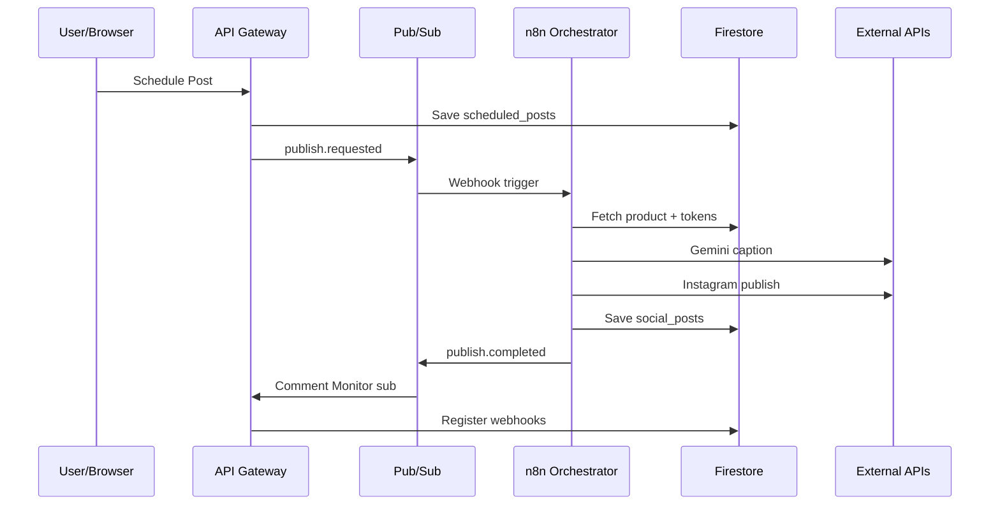

# AutoBot360 — Multi-Agent Architecture

## Agent Communication Flow



---

## Agent 1: AUTH AGENT

### Responsibilities
- Firebase Auth signup/login (email, Google, phone)
- Custom JWT issuance with `tenantId`, `role`, `subscriptionTier`
- RBAC permission checks
- Subscription gate middleware

### APIs
| Method | Path | Description |
|--------|------|-------------|
| POST | `/api/v1/auth/signup` | Create account |
| POST | `/api/v1/auth/login` | Exchange Firebase token for API JWT |
| POST | `/api/v1/auth/refresh` | Refresh JWT |
| GET | `/api/v1/auth/me` | Current user profile |
| POST | `/api/v1/auth/invite` | Team invite (Pro+) |

### Database
- `users/{userId}`
- `subscriptions/{tenantId}`
- `idempotency_keys/{key}`

### Queue
- Publishes: `tenant.created`

### Communication
```
Client → Firebase Auth → API /login → Verify ID token → Issue JWT
                      → Firestore users doc → Pub/Sub tenant.created → n8n welcome
```

---

## Agent 2: USER DASHBOARD AGENT

### Responsibilities
- Aggregate dashboard KPIs
- Realtime notification feed
- Widget data (sales, posts, leads, engagement)
- Activity timeline

### APIs
| Method | Path | Description |
|--------|------|-------------|
| GET | `/api/v1/dashboard` | Full dashboard payload |
| GET | `/api/v1/dashboard/widgets/:type` | Single widget |
| GET | `/api/v1/dashboard/activity` | Paginated activity feed |

### Database
- Reads: `orders`, `social_posts`, `analytics`, `notifications`, `leads`
- Writes: none (read-only aggregation)

### Queue
- Subscribes: `order.created`, `lead.captured`, `publish.completed`
- Updates: `dashboard_cache/{tenantId}` via worker

### Realtime
- Firestore `onSnapshot` on `notifications` where `tenantId == X`
- FCM for mobile push

---

## Agent 3: PRODUCT AGENT

### Responsibilities
- Product CRUD with variants
- Media upload to Firebase Storage
- Inventory tracking
- AI-generated descriptions via Gemini

### APIs
| Method | Path | Description |
|--------|------|-------------|
| GET | `/api/v1/products` | List products |
| POST | `/api/v1/products` | Create product |
| GET | `/api/v1/products/:id` | Get product |
| PUT | `/api/v1/products/:id` | Update product |
| DELETE | `/api/v1/products/:id` | Soft delete |
| POST | `/api/v1/products/:id/media` | Upload images |
| POST | `/api/v1/products/:id/ai-description` | Generate AI copy |

### Database
- `products/{productId}`
- Storage: `tenants/{tenantId}/products/{productId}/{filename}`

### Queue
- Publishes: `product.created`, `product.updated`

---

## Agent 4: SOCIAL CONNECT AGENT

### Responsibilities
- OAuth flows: Instagram, Facebook, YouTube, Google Business
- Token encryption (AES-256-GCM) → Secret Manager reference
- Token refresh scheduling
- Account health validation

### APIs
| Method | Path | Description |
|--------|------|-------------|
| GET | `/api/v1/social/accounts` | List connected accounts |
| GET | `/api/v1/social/connect/:platform` | OAuth redirect URL |
| GET | `/api/v1/social/callback/:platform` | OAuth callback |
| DELETE | `/api/v1/social/accounts/:id` | Disconnect |
| POST | `/api/v1/social/accounts/:id/refresh` | Force token refresh |

### Database
- `social_accounts/{accountId}` — metadata only, NO raw tokens
- Secret Manager: `social-token-{tenantId}-{accountId}`

### Queue
- Publishes: `token.expiring` (scheduled daily scan)
- n8n: Token Refresh Workflow

### Token Storage Flow
```
OAuth callback → Encrypt tokens → Secret Manager.createSecret()
              → Firestore social_accounts { secretRef, expiresAt, platform, scopes }
              → Schedule refresh 7 days before expiry
```

---

## Agent 5: PUBLISH AGENT

### Responsibilities
- Schedule posts for future publish
- Trigger publish pipeline
- AI caption/hashtag coordination
- Retry failed publishes

### APIs
| Method | Path | Description |
|--------|------|-------------|
| POST | `/api/v1/publish/schedule` | Schedule post |
| GET | `/api/v1/publish/scheduled` | List scheduled |
| PUT | `/api/v1/publish/scheduled/:id` | Reschedule |
| DELETE | `/api/v1/publish/scheduled/:id` | Cancel |
| POST | `/api/v1/publish/now/:id` | Immediate publish |

### Database
- `scheduled_posts/{postId}`
- `social_posts/{postId}`

### Queue
- Publishes: `publish.requested`
- Subscribes: `publish.completed`, `publish.failed`

### n8n Workflows
- Publish Product, AI Caption, Social Media Publish, Scheduled Post, Failed Retry

---

## Agent 6: COMMENT MONITOR AGENT

### Responsibilities
- Register platform webhooks after publish
- Ingest comment events
- Buying intent detection trigger
- Lead creation handoff

### APIs
| Method | Path | Description |
|--------|------|-------------|
| POST | `/api/v1/comments/webhook/:platform` | Platform webhook ingress |
| GET | `/api/v1/comments` | List comments |
| GET | `/api/v1/comments/:id` | Comment detail |
| POST | `/api/v1/comments/:id/approve-reply` | Approve AI reply (optional) |

### Database
- `comments/{commentId}`
- `leads/{leadId}`

### Queue
- Publishes: `comment.received`
- n8n: Comment Monitoring, Lead Capture

---

## Agent 7: AI SALES AGENT

### Responsibilities
- Conversational AI for DMs/comments
- FAQ from product catalog
- Pricing and availability responses
- Checkout link generation
- Follow-up sequences

### APIs
| Method | Path | Description |
|--------|------|-------------|
| POST | `/api/v1/ai-sales/chat` | Process message |
| GET | `/api/v1/ai-sales/conversations` | List conversations |
| PUT | `/api/v1/ai-sales/settings` | AI tone, auto-reply rules |

### Database
- `ai_replies/{replyId}`
- `customers/{customerId}` — conversation history

### AI Context Window
```json
{
  "system": "You are a sales assistant for {storeName}...",
  "products": ["..."],
  "policies": { "shipping": "...", "returns": "..." },
  "conversation": ["..."]
}
```

### n8n: AI Reply Workflow

---

## Agent 8: CHECKOUT AGENT

### Responsibilities
- Public checkout sessions
- Cart management
- Address collection
- Tax calculation (GST India)
- Shipping rate estimation

### APIs
| Method | Path | Description |
|--------|------|-------------|
| POST | `/api/v1/checkout/session` | Create session |
| GET | `/api/v1/checkout/session/:id` | Get session |
| PUT | `/api/v1/checkout/session/:id` | Update cart/address |
| GET | `/api/v1/checkout/session/:id/total` | Calculate total |

### Database
- `checkout_sessions/{sessionId}` — TTL 24h

### Queue
- Publishes: `checkout.started`

---

## Agent 9: PAYMENT AGENT

### Responsibilities
- Razorpay order creation
- Payment signature verification
- Webhook processing
- Invoice PDF generation

### APIs
| Method | Path | Description |
|--------|------|-------------|
| POST | `/api/v1/payments/create-order` | Razorpay order |
| POST | `/api/v1/payments/verify` | Client-side verify |
| POST | `/api/v1/payments/webhook` | Razorpay webhook |
| GET | `/api/v1/payments/:id` | Payment status |

### Database
- `payments/{paymentId}`

### Queue
- Publishes: `payment.success`, `payment.failed`
- n8n: Razorpay Payment Workflow

### Security
- Webhook HMAC validation with Razorpay secret from Secret Manager
- Idempotency on `razorpay_payment_id`

---

## Agent 10: ORDER AGENT

### Responsibilities
- Order creation from payment
- Status lifecycle (pending → confirmed → shipped → delivered)
- Seller notifications
- Shipping label integration (future)

### APIs
| Method | Path | Description |
|--------|------|-------------|
| GET | `/api/v1/orders` | List orders |
| GET | `/api/v1/orders/:id` | Order detail |
| PUT | `/api/v1/orders/:id/status` | Update status |
| POST | `/api/v1/orders/:id/ship` | Mark shipped |

### Database
- `orders/{orderId}`

### Queue
- Subscribes: `payment.success`
- Publishes: `order.created`

---

## Agent 11: WHATSAPP AGENT

### Responsibilities
- Template and session messages
- Order status updates to customers
- Seller alert messages
- Message delivery logging

### APIs
| Method | Path | Description |
|--------|------|-------------|
| POST | `/api/v1/whatsapp/send` | Send message |
| GET | `/api/v1/whatsapp/logs` | Message logs |
| POST | `/api/v1/whatsapp/webhook` | Meta webhook |

### Database
- `whatsapp_logs/{logId}`

### n8n: WhatsApp Notification Workflow

---

## Agent 12: ANALYTICS AGENT

### Responsibilities
- Engagement metrics aggregation
- Sales funnel tracking
- Conversion rate computation
- AI-generated insights (weekly digest)

### APIs
| Method | Path | Description |
|--------|------|-------------|
| GET | `/api/v1/analytics/overview` | Dashboard metrics |
| GET | `/api/v1/analytics/posts` | Post performance |
| GET | `/api/v1/analytics/sales` | Revenue analytics |
| GET | `/api/v1/analytics/ai-insights` | Gemini insights |

### Database
- `analytics/{tenantId}/daily/{date}`
- `analytics/{tenantId}/posts/{postId}`

### Queue
- Subscribes: all `*.completed` events
- n8n: Analytics Sync Workflow (hourly)

---

## Agent 13: NOTIFICATION AGENT

### Responsibilities
- In-app notification CRUD
- FCM push delivery
- Email via SMTP/SendGrid
- Notification preferences

### APIs
| Method | Path | Description |
|--------|------|-------------|
| GET | `/api/v1/notifications` | List notifications |
| PUT | `/api/v1/notifications/:id/read` | Mark read |
| PUT | `/api/v1/notifications/preferences` | Update prefs |

### Database
- `notifications/{notificationId}`

### Queue
- Subscribes: `notification.send`

---

## Agent 14: N8N ORCHESTRATION AGENT

### Responsibilities
- Workflow execution triggers
- Webhook endpoint management
- Execution status tracking
- Retry orchestration
- Workflow health monitoring

### APIs
| Method | Path | Description |
|--------|------|-------------|
| POST | `/api/v1/orchestration/trigger/:workflow` | Manual trigger |
| GET | `/api/v1/orchestration/executions` | Execution history |
| POST | `/api/v1/orchestration/webhook/:workflowId` | Internal webhook relay |
| GET | `/api/v1/orchestration/health` | n8n cluster health |

### Database
- `workflow_executions/{executionId}`

### Queue
- Central hub: receives Pub/Sub push → forwards to n8n webhook URLs

### Webhook URL Pattern
```
https://n8n.autobot360.com/webhook/{workflow-name}/{tenantId}
Headers: X-Webhook-Secret, X-Tenant-Id, X-Idempotency-Key
```
